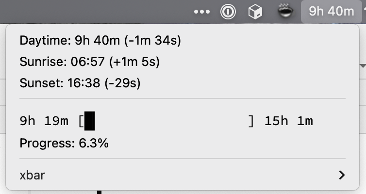

# solar

Plugin for [xbar](https://xbarapp.com) that shows information about the solar cycle.

Example usage after installing:

`SOLAR_LATITUDE=40.1 SOLAR_LONGITUDE=-105.2 solar`

"Progress" shows how close/far today is from the shortest and longest upcoming days. Nice when I'm really feeling how
short the days are getting, but the minimum is in sight and not _that_ much shorter.
